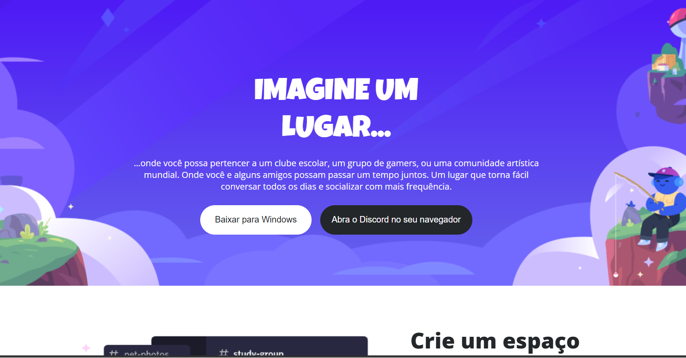

# Desafio de Projeto CSS: Construindo um Layout Responsivo Para o Site do Discord Com CSS
Projeto de HMTL e CSS do clone da página do Discord usando os conceitos de responsividade e mobile first. 
Esse projeto foi proposto pela expert Michele Ambrosio da plataforma educacional DIO na Formação CSS Developer.

## Tecnologias utilizadas

## Metodologia de desenvolvimento
- Utilização do Layout disponibilizado no arquivo Figma disponível [aqui](https://www.figma.com/design/NRBYrG5d4DSzObv7dpTqoM/Desafio-Responsividade---DIO?node-id=1-2&t=Rk2enWJM1vbyLjuU-0)
- Utilização de unidades de medidas relativas 'rem';
- Codificação considerando o conceito Mobile-First.

## Acesso
A aplicação pode ser acessada [aqui](https://dmoprates.github.io/Disclone/)

## Pré-Visualização
- Visualização para desktop

- Visualização para mobile
